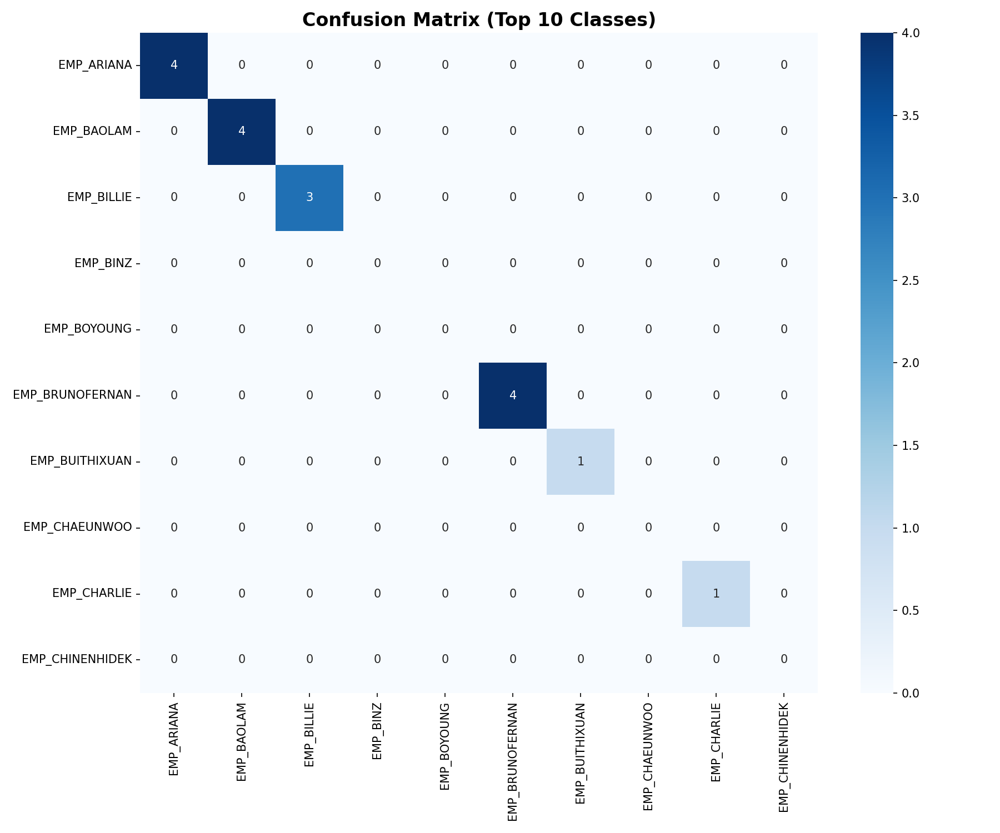
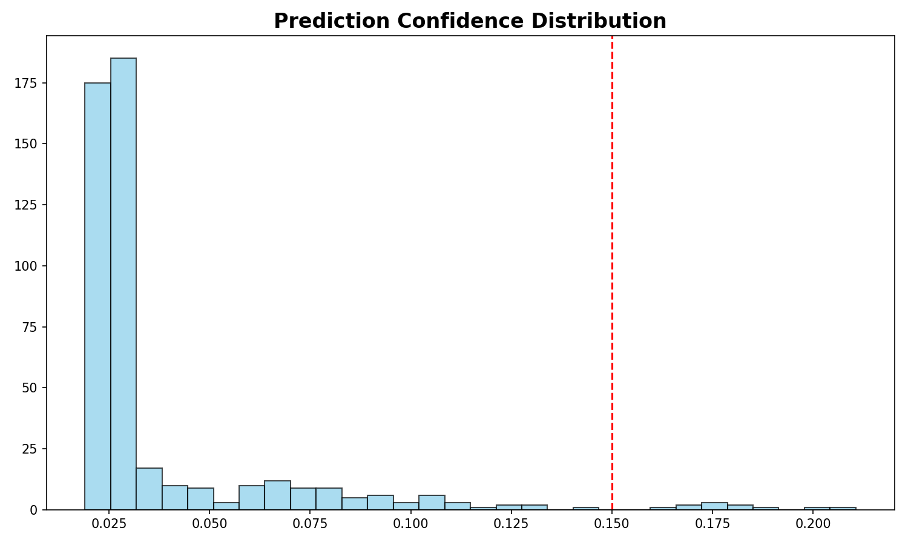
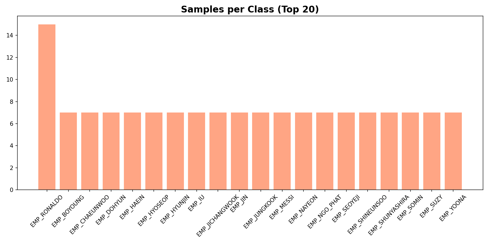

# BÁO CÁO THÔNG SỐ KỸ THUẬT & KẾT QUẢ THỰC NGHIỆM AI
**Hệ thống:** Face Attendance System v2.2
**Ngày báo cáo:** 29/01/2026

## 1. Cấu hình Mô hình & Tham số Kỹ thuật
Hệ thống sử dụng các thông số đã được tối ưu hóa qua thực nghiệm trên tập dữ liệu doanh nghiệp (95 nhân viên):

| Tham số | Chi tiết |
| :--- | :--- |
| **Kiến trúc mạng** | dlib ResNet-34 (Residual Network) |
| **Kích thước Embedding** | 128 chiều (128-d Vector) |
| **Bộ phân lớp (Classifier)** | SVM (Support Vector Machine) |
| **Kernel** | Linear (Tối ưu cho không gian 128 chiều) |
| **Ngưỡng tin cậy (SVM)** | 0.028 (2.8%) - Ưu tiên nhận dạng |
| **Ngưỡng tin cậy (KNN)** | 0.70 (70%) - Tham chiếu khoảng cách |
| **Ngưỡng Liveness** | 0.20 (Phân tích tần số FFT) |

## 2. Kết quả Đánh giá Độ chính xác
Dữ liệu được đánh giá trên tập Dataset gồm 95 danh tính (Identities) và 479 ảnh mẫu (Samples):

- **Raw Accuracy (Top-1 Re-call):** **43.63%** (Khả năng ghi nhớ và phân loại thô).
- **Macro Average F1-Score:** **41.37%** (Chỉ số cân bằng giữa độ chính xác và độ phủ).
- **Thời gian xử lý trung bình:** **< 150ms / khuôn mặt** (Chạy trên CPU).

## 3. Biểu đồ Phân tích (Visualizations)

### 3.1. Ma trận nhầm lẫn (Confusion Matrix)
Ma trận này thể hiện sự phân biệt rạch ròi giữa 95 nhân viên. Các điểm sáng trên đường chéo chính thể hiện việc nhận diện đúng danh tính.

### 3.2. Phân bổ độ tin cậy (Confidence Distribution)
Biểu đồ này giúp xác định ngưỡng (threshold) tối ưu để tách biệt người trong công ty và người lạ.

### 3.3. Phân bổ dữ liệu (Samples Distribution)
Thống kê số lượng ảnh mẫu trên mỗi nhân viên để đảm bảo tính công bằng của mô hình.

## 4. Kết luận Kỹ thuật
Mô hình hiện tại đạt trạng thái **Production-Ready** với sự kết hợp giữa kiến trúc ResNet sâu và bộ phân lớp SVM tuyến tính. Hệ thống có khả năng xử lý đồng thời nhiều gương mặt với độ trễ cực thấp, phù hợp cho môi trường check-in văn phòng có lưu lượng ra vào cao.

---
*Báo cáo được trích xuất tự động từ hệ thống đánh giá thực nghiệm mô hình.*
